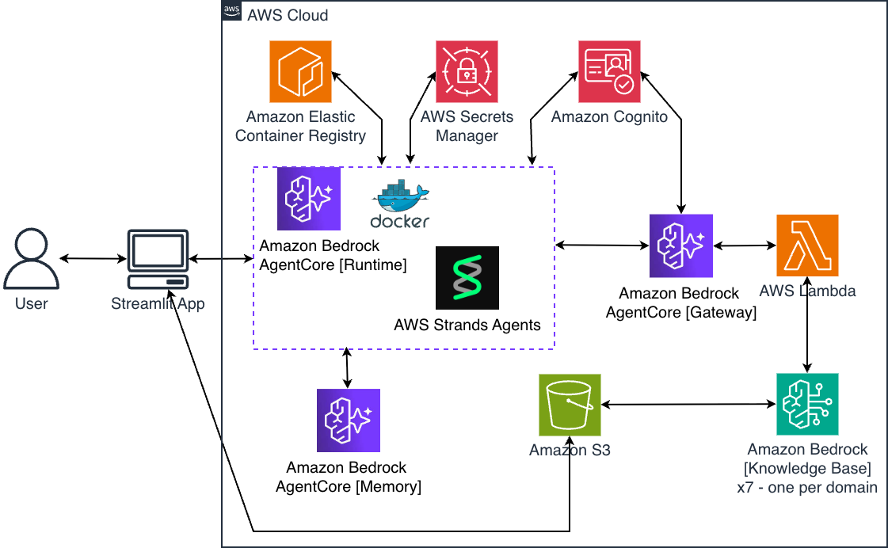
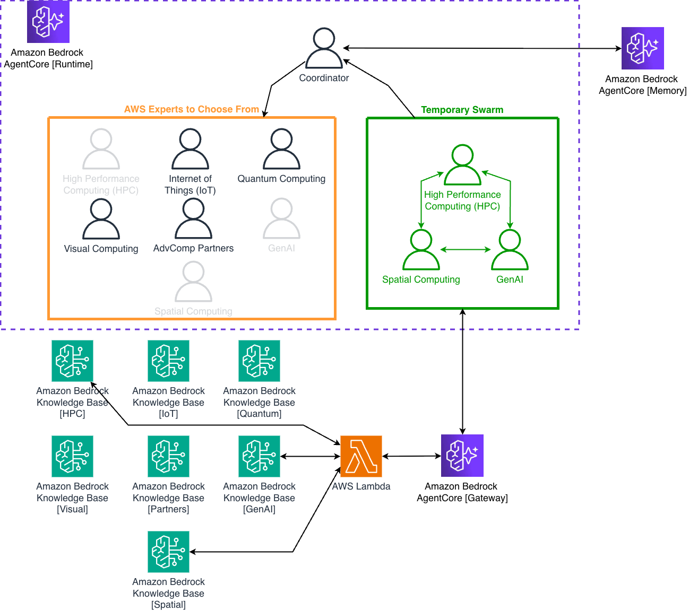

# Advanced Computing Team Collaboration Swarm

> **Note**: This is a sample/demonstration project. It is not intended for production use without additional security hardening, permission scoping, and operational considerations.

A multi-agent system that dynamically creates teams of specialized AI agents to answer questions about advanced computing topics. The system uses Amazon Bedrock AgentCore, AWS Strands Agents, and Model Context Protocol (MCP) for knowledge base access.

## What This Does

This project demonstrates a coordinator agent that:
1. Analyzes incoming questions
2. Selects 2-3 relevant domain experts (HPC, Quantum, GenAI, Visual, Spatial, IoT, Partners)
3. Creates a temporary swarm of those experts
4. Facilitates collaboration between experts with access to AWS documentation
5. Maintains conversation memory across sessions

## Architecture

### AWS Infrastructure



### Multi-Agent System



*Example shown: Coordinator selects 3 experts (HPC, Spatial, GenAI) from a pool of 7 available domain experts.*

The system uses a **coordinator-expert pattern** where a coordinator agent analyzes queries, selects 2-3 relevant domain experts, and creates a temporary swarm for collaboration. Experts access domain-specific knowledge bases through an MCP Gateway using OAuth JWT authentication. All interactions are stored in AgentCore Memory for context continuity.

**Request Flow:**
1. User submits query via Streamlit web app
2. Coordinator checks memory for relevant past knowledge
3. If needed, coordinator calls `advcomp_swarm()` tool with selected experts
4. Expert swarm is created dynamically with MCP tools for knowledge base access
5. Experts collaborate via handoffs, querying knowledge bases as needed
6. Gateway authenticates requests (OAuth JWT) and routes to Lambda
7. Lambda queries Bedrock Knowledge Bases and returns formatted results
8. Swarm synthesizes final response from expert contributions
9. Coordinator saves conversation and learnings to memory

**Key Components:**
- **Coordinator Agent**: Analyzes queries, selects experts, manages memory
- **Expert Agents**: Domain specialists (HPC, Quantum, GenAI, Visual, Spatial, IoT, Partners)
- **AgentCore Runtime**: Serverless container hosting the agent code
- **AgentCore Gateway**: MCP protocol gateway with OAuth 2.0 JWT authentication
- **AgentCore Memory**: Semantic memory with 90-day retention
- **Knowledge Bases**: 7 domain-specific Bedrock KBs with S3 document storage
- **Lambda Function**: Handles KB queries via RetrieveAndGenerate API
- **Streamlit Web UI**: Chat interface with telemetry visualization

See [ARCHITECTURE.md](ARCHITECTURE.md) for detailed technical documentation.

## Prerequisites

**AWS Services Required:**
- Amazon Bedrock (with model access enabled)
- Amazon Bedrock AgentCore (access requested)
- Amazon ECR
- AWS Lambda
- Amazon Cognito
- IAM permissions for CDK deployment

**Local Environment:**
- Python 3.10+
- Docker (for CDK to build agent container)
- AWS CLI configured with credentials
- AWS CDK (`npm install -g aws-cdk`)
- Node.js 18+ (for CDK)

**Supported Regions:** us-east-1, us-west-2

**Note**: CDK will automatically build Docker images during deployment. Ensure Docker daemon is running.

## Quick Start

### 1. Environment Setup

```bash
# Clone and setup
python -m venv .venv
source .venv/bin/activate  # Windows: .venv\Scripts\activate

# Install dependencies
pip install -r requirements.txt
pip install -r agent/requirements.txt
pip install -r web_app/requirements.txt

# Configure environment
cp .env.template .env
# Edit .env with your AWS_REGION and credentials
```

### 2. Deploy Infrastructure

```bash
# Deploy all components via CDK (single command)
cdk deploy --require-approval never
```

**What CDK deploys automatically:**
- ✅ IAM roles with required permissions
- ✅ ECR repository (advcomp-agent)
- ✅ Docker image build (ARM64 architecture)
- ✅ Image push to ECR (using cdk-ecr-deployment)
- ✅ AgentCore Runtime (advcomp_swarm_cdk)
- ✅ AgentCore Gateway with JWT authentication
- ✅ Lambda function for knowledge base queries
- ✅ S3 buckets for domain knowledge bases

**Deployment time:** ~5-10 minutes (includes Docker build)

### 3. Populate Knowledge Bases (Optional)

**Note**: The deployment creates empty S3 buckets and knowledge bases. You'll need to upload documents to enable expert knowledge base queries.

Upload documents to domain-specific S3 buckets:
```bash
# Get bucket names from CDK outputs
export HPC_BUCKET=$(aws cloudformation describe-stacks --stack-name AdvcompAgenticStrandscoreDemoStack --query "Stacks[0].Outputs[?OutputKey=='HpcKnowledgeBucketName'].OutputValue" --output text)

# Upload documents to S3 buckets
aws s3 cp your-hpc-docs/ s3://$HPC_BUCKET/ --recursive
# ... repeat for other domains

# Trigger knowledge base sync (or use web app KB Manager page)
python utils/kb_manager.py --sync-all
```

Alternatively, use the web app's Knowledge Base Manager page to upload documents.

**Without documents**: The system will work but experts won't have domain-specific knowledge to query.

### 4. Run Web Interface

```bash
cd web_app
streamlit run app.py
```

Access at http://localhost:8501

## Configuration

### Model Selection

Default model: `us.anthropic.claude-sonnet-4-5-20250929-v1:0`

Configure per-agent models in `agent/agent_config.py`:

```python
AGENT_MODELS = {
    "coordinator": "us.anthropic.claude-sonnet-4-5-20250929-v1:0",
    "hpc_expert": DEFAULT_MODEL_ID,
    # ...
}
```

### Environment Variables

See `.env.template` for all configuration options. Key variables:

- `AWS_REGION`: AWS region (us-east-1 or us-west-2)
- `BEDROCK_MODEL_ID`: Default model for agents
- `MEMORY_ENABLED`: Enable/disable persistent memory
- `GATEWAY_URL`: MCP Gateway URL (set after deployment)
- Gateway uses OAuth 2.0 client credentials flow with Cognito for JWT authentication

## Project Structure

```
├── advcomp_agentic_strandscore_demo/
│   └── advcomp_agentic_strandscore_demo_stack.py  # CDK infrastructure
├── agent/                 # Agent container code (built by CDK)
│   ├── advcomp_swarm.py   # Main swarm logic
│   ├── domain_prompts.py  # Expert system prompts
│   ├── agent_config.py    # Model configuration
│   ├── telemetry.py       # Telemetry utilities
│   └── Dockerfile         # ARM64 container definition
├── gateway_tools/         # MCP Gateway Lambda functions
│   └── knowledge_base/
│       └── knowledge_base_lambda.py  # KB query handler
├── images/                # Architecture diagrams
│   ├── aws-architecture-diagram.png
│   └── agent-architecture-diagram.png
├── utils/                 # Utility scripts
│   ├── kb_manager.py      # Knowledge base management
│   ├── kb_upload.py       # Document upload utility
│   └── find_kb_ids.py     # KB ID lookup
├── web_app/               # Streamlit interface
│   ├── app.py             # Main web application
│   ├── components/        # UI components
│   └── pages/             # Multi-page app pages
├── app.py                 # CDK app entry point
├── cdk.json               # CDK configuration
├── requirements.txt       # CDK dependencies
└── .env.template          # Configuration template
```

## Usage Examples

**Multi-Domain Questions:**
- "How can quantum computing accelerate HPC workloads?"
- "What's the best approach for IoT data processing with GenAI?"

**AWS-Specific Questions:**
- "What are the EFA configuration requirements for AWS PCS?"
- "How do I optimize MPI communication in ParallelCluster?"

**Follow-up Questions:**
- "Do you remember our discussion about quantum algorithms?"
- "Based on what we talked about, how would that apply to drug discovery?"

## How It Works

### Expert Selection
The coordinator analyzes queries and automatically selects 2-3 relevant experts:
- **hpc**: Parallel computing, clusters, AWS PCS
- **quantum**: Quantum algorithms, Amazon Braket
- **genai**: AI/ML, LLMs, AWS Bedrock
- **visual**: 3D graphics, GPU acceleration
- **spatial**: Geospatial, AR/VR, digital twins
- **iot**: Sensors, edge computing, AWS IoT
- **partners**: Technology partnerships, ISVs

### Knowledge Base Access
Experts query AWS documentation in real-time via MCP Gateway:
- JWT-authenticated access
- Domain-specific knowledge bases
- 5-result vector search per query
- Full observability of tool usage

### Memory System
- Maintains conversation context across sessions
- Semantic memory strategy for user profiling
- Stores expert team compositions for learning
- Memory-first approach: checks memory before calling experts

## Testing

**Note**: Test files are for development reference and are not included in the repository.

If you're developing locally, you can create tests following these patterns:

```bash
# Test knowledge base Lambda
python tests/test_knowledge_base.py --domain hpc --query "MPI optimization"

# Test memory integration
python tests/test_memory_tools_fix.py

# Unit tests
python -m unittest tests/unit/test_knowledge_base_lambda.py
```

## Deployment Details

### Initial Deployment
```bash
cdk deploy --require-approval never
```

### Updating Deployment
```bash
# CDK automatically detects changes and updates only what changed
cdk deploy
```

**What gets updated:**
- Agent code changes → New Docker image built and pushed, Runtime updated
- Lambda code changes → Lambda function updated
- IAM policy changes → Roles updated
- Gateway configuration → Gateway updated

**CDK handles:**
- ✅ Incremental updates (only changed resources)
- ✅ Rollback on failure
- ✅ Resource dependencies
- ✅ Output file generation (cdk-outputs.json)

## Troubleshooting

### Gateway Authentication
- Gateway uses OAuth 2.0 client credentials flow with Cognito
- Agent retrieves short-lived JWT access tokens automatically
- OAuth credentials stored in AWS Secrets Manager
- No manual token management required - agent handles token refresh

### Agent Deployment
- Check CloudWatch logs: `/aws/bedrock-agentcore/runtimes/advcomp_swarm_cdk-*`
- Verify Docker daemon is running before deployment

### Knowledge Base Access
- **Knowledge bases are created empty** - you must upload documents to S3 buckets
- Use the web app's Knowledge Base Manager page or `utils/kb_upload.py` to add documents
- Lambda needs correct KB IDs in environment variables (auto-populated by CDK)
- Without documents, experts cannot query domain-specific knowledge

## Limitations

- Response time: 25-60 seconds for multi-expert queries (complex queries may take up to 200 seconds)
- Maximum 20 handoffs, 20 iterations per swarm
- 30-minute total execution timeout
- Requires manual knowledge base document upload and ingestion
- Docker required for deployment (CDK builds agent container automatically)
- Supported regions: us-east-1, us-west-2

## License

MIT License - See LICENSE file for details

## Contributing

This is a sample/reference project demonstrating multi-agent systems with AWS Bedrock AgentCore. Feel free to fork and adapt for your use cases.

## AWS Services Used

This solution leverages the following AWS services:

- **Amazon Bedrock**: Foundation model access for AI agents
- **Amazon Bedrock AgentCore**: Serverless runtime for multi-agent orchestration
- **Amazon Bedrock Knowledge Bases**: Vector search for domain-specific documentation
- **AWS Lambda**: Serverless functions for knowledge base queries
- **Amazon Cognito**: User authentication and authorization
- **Amazon ECR**: Container registry for agent images
- **Amazon S3**: Storage for knowledge base documents
- **AWS IAM**: Access control for service integration
- **Amazon CloudWatch**: Logging and monitoring

## Infrastructure as Code

All infrastructure is defined and deployed using **AWS CDK** (Cloud Development Kit):

- Single command deployment: `cdk deploy`
- Automatic Docker image builds (ARM64 architecture)
- IAM roles with required permissions for service integration
- JWT-based authentication via Cognito
- Incremental updates with automatic rollback on failure

**Important**: This is a sample project for demonstration purposes. Adapting this for production use would require additional security hardening and operational considerations. See SECURITY.md for more information.

The CDK stack creates:
- AgentCore Runtime for multi-agent orchestration
- AgentCore Gateway for secure knowledge base access
- Lambda functions for knowledge base queries
- Cognito user pool for authentication
- ECR repository with automated image deployment
- S3 buckets for domain-specific knowledge bases

## Additional Documentation

- `.env.template`: Complete environment variable reference
- `ARCHITECTURE.md`: System architecture and data flows
- `agent/domain_prompts.py`: Expert system prompts and domain definitions
